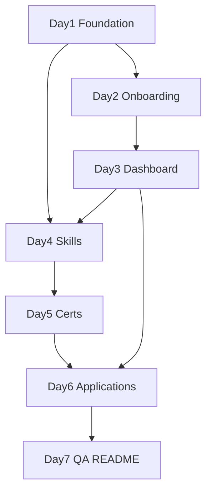

# PathPilot — One-Week Implementation Plan

> Actionable build guide derived from [PRODUCT_PLAN.md](PRODUCT_PLAN.md).  
> **Stack:** SwiftUI · MVVM · SwiftData · iOS 17+ · Local-only (no auth)  
> **Timeline:** 7 days · 6–8 focused hours per day (~45 hours total)

---

## How to Use This Document

1. Work through **Days 1–7 in order** — each day builds on the last.
2. Check off each step as you complete it.
3. **Commit to GitHub after every day** with a clear message (e.g. `feat: add onboarding flow`).
4. Run the app in the simulator after every checkpoint to catch issues early.
5. If behind schedule, use the **"If Behind" cuts** listed on each day — do not skip ahead to new features.
6. If stuck on the current step, finish it before moving on.

**Legend**

| Symbol | Meaning |
|---|---|
| 📁 | Create file or folder |
| ✏️ | Edit existing file |
| ✅ | Verification — app should behave this way |
| 💡 | Concept to understand (look up in Apple docs if needed) |
| ⏱ | Rough time estimate |
| ⚠️ | Schedule risk — simplify if behind |

---

## Before You Start

### Prerequisites

- [ ] Xcode 15+ installed
- [ ] iOS 17+ simulator configured
- [ ] GitHub repo connected (`PathPilot` project already exists)
- [ ] Read [PRODUCT_PLAN.md](PRODUCT_PLAN.md) sections 7–9 (screens, architecture, data models)

### Final Folder Structure (reference)

```
PathPilot/
├── App/
│   └── PathPilotApp.swift
├── Models/
├── ViewModels/
├── Views/
│   ├── Onboarding/
│   ├── Dashboard/
│   ├── Skills/
│   ├── Certifications/
│   ├── Applications/
│   └── Profile/
├── Components/
├── Services/
└── Extensions/
```

**Current starting point:** Step 1.1 is ~80% complete — folder groups exist, `PathPilotApp.swift` is in `App/`, `ContentView.swift` is removed. Begin Day 1 at theme + tabs + models.

---

## Scope: Version 1 vs Version 2

### Version 1 — One Week MVP (this document)

Achievable in 7 days × 6–8 hours. Portfolio-quality, not feature-complete.

| Feature | Status |
|---|---|
| Feature-based folder architecture (MVVM + SwiftData) | V1 |
| 5-step onboarding with `@AppStorage` gate | V1 |
| Dashboard with progress ring + milestone checklist | V1 |
| Skills tracker (Current / To Learn, CRUD) | V1 |
| Certification tracker (CRUD + status badges) | V1 |
| Job application tracker (status pipeline) | V1 |
| ProgressCalculator wired to live data | V1 (simplified first) |
| Profile tab (read-only display) | V1 |
| Theme + reusable components | V1 |
| Dark mode via semantic colors | V1 |
| README + screenshots + GitHub push | V1 |

### Version 2 — Future Enhancements

| Feature | Reason to defer |
|---|---|
| Sign in with Apple / CloudKit sync | Not needed for local-first MVP |
| Multiple career goals | Adds UI + data complexity |
| Career transition templates | Content problem, not engineering |
| Profile editing (edit sheets) | Read-only profile sufficient for V1 |
| Milestone due dates + notifications | Requires scheduling + permissions |
| SkillDetailView with notes | Edit-via-sheet covers MVP |
| Grouped application sections | Flat list with badge is V1 fallback |
| Full weighted ProgressCalculator | Milestone-based % first; full formula in V2 |
| Analytics protocol + 12 events | 0–2 console prints sufficient for V1 |
| Custom app icon | Use Xcode default for V1 |
| Full accessibility audit | Basic label on progress ring only |
| Demo video (YouTube/Loom) | Optional post-week stretch |
| AI assistant, widgets, PDF export, StoreKit | Explicitly out of scope |

---

## Changes from Original 9-Phase Plan

The original plan spread the same MVP across 6–8 weeks. This revision merges phases and cuts optional scope.

| Original | Action |
|---|---|
| Phase 1 (1 week) setup separate from models | **Merged into Day 1** |
| Model stubs Day 1 → flesh out Day 2 | **Complete models incrementally** (core on Day 1, rest on feature days) |
| Component stubs before use (Step 1.5) | **Removed** — build when first needed |
| SkillDetailView (Step 4.3) | **Cut** — edit via shared form sheet |
| 12 analytics events | **Cut** — optional 1–2 console prints |
| Phase 7 persistence week | **Merged** — verify after each feature day |
| Phase 8 polish week | **Split** — semantic colors Day 1; light pass Day 7 |
| Phase 9 docs week | **Day 7 only** |
| Profile edit with two sheets | **Postponed to V2** |
| Kanban applications | **Never planned** — grouped or flat list only |

---

## Schedule Risk Register

Top risks that could prevent finishing in one week, with recommended actions.

| Risk | Impact | Simpler alternative | Verdict |
|---|---|---|---|
| Day 6 overload (apps + profile + polish) | Critical — 1–2 day slip | Apps only on Day 6; polish on Day 7 | **Split Day 6** |
| SwiftData debugging on Days 1–2 | High — 4–8 hrs lost | Register models incrementally; one save path early | **Keep, simplify** |
| ProgressRing + full calculator on Day 3 | High — 4–6 hrs | Milestone-only % first; add weights after CRUD | **Keep ring, simplify calc** |
| 5-step onboarding + chip UI for skills | High — 3–6 hrs | Comma-separated text fields instead of chips | **Keep flow, simplify input** |
| Three CRUD trackers in 3 days | Medium-High | Share one form sheet pattern; flat app list fallback | **Keep all three** |
| Five separate ViewModels | Medium — 2–4 hrs | ViewModels for onboarding + dashboard only | **Keep MVVM, fewer VMs** |
| Grouped application list | Medium — 2–3 hrs | Flat list with status badge | **Postpone grouping to V2** |
| Profile editing (two sheets) | Medium — 2–3 hrs | Read-only profile + reset onboarding | **Postpone to V2** |
| Analytics protocol | Low — 1–2 hrs | Skip entirely or 1 print statement | **Postpone to V2** |
| Day 7 zero buffer | Medium-High | 2–3 screenshots; short README | **Keep README, simplify** |

**If you adopt only three cuts:** (1) split Day 6, (2) simplify onboarding skills input, (3) milestone-only progress on Day 3.

---

## Day 1 — Foundation & Data Layer

**Goal:** Replace boilerplate with navigable app shell, theme, and core SwiftData setup.  
**⏱:** 6–7 hours · **Depends on:** nothing

### Tasks

- [ ] Verify folder groups in Xcode (no `.gitkeep` files — they cause build errors)
- [ ] 📁 Create `Extensions/Color+Theme.swift`:

```swift
extension Color {
    static let pathPilotPrimary = Color(red: 0.106, green: 0.227, blue: 0.361)
    static let pathPilotAccent = Color(red: 0.180, green: 0.800, blue: 0.443)
    static let pathPilotBackground = Color(.systemGroupedBackground)
    static let pathPilotCard = Color(.secondarySystemBackground)
}
```

- [ ] ✏️ Update `Assets.xcassets/AccentColor.colorset` to match `pathPilotAccent`
- [ ] 📁 Create `Views/MainTabView.swift` + 5 placeholder tab views
- [ ] 📁 Create `Views/RootView.swift` → shows `MainTabView`
- [ ] 📁 Create core SwiftData models on Day 1:
  - `Models/UserProfile.swift`
  - `Models/CareerGoal.swift`
  - `Models/Milestone.swift`
  - `Models/Enums.swift` (partial — add cert/app enums on feature days)
- [ ] ✏️ Wire `ModelContainer` in `App/PathPilotApp.swift` (register Day 1 models; add others on Days 4–6)
- [ ] 📁 Create `Components/CareerCard.swift` + `Components/EmptyStateView.swift`

**TabView setup:**

| Tab | Label | SF Symbol |
|---|---|---|
| 1 | Dashboard | `chart.line.uptrend.xyaxis` |
| 2 | Skills | `brain.head.profile` |
| 3 | Certifications | `rosette` |
| 4 | Applications | `briefcase` |
| 5 | Profile | `person.circle` |

Set tab accent: `.tint(.pathPilotAccent)`

### ✅ Checkpoint

- App launches → 5 tabs visible → tapping each switches screens
- Theme colors render in `#Preview`
- Build succeeds with ModelContainer registered
- Git commit: `feat: project foundation, theme, tabs, SwiftData models`

### ⚠️ If Behind

- Skip `EmptyStateView` — add on Day 4 with Skills
- Use placeholder tabs with `Text("Coming soon")` only — no icons yet

---

## Day 2 — Onboarding Flow

**Goal:** First-time users complete onboarding and land in the main app with persisted data.  
**⏱:** 7–8 hours · **Depends on:** Day 1 models + RootView

### Tasks

- [ ] 📁 Create `Models/Skill.swift` + register in ModelContainer
- [ ] 📁 Create `ViewModels/OnboardingViewModel.swift` (`@Observable`)
  - Properties: `currentStep` (0–4), `name`, `currentBackground`, `targetRole`, `currentSkills`, `skillsToLearn`, `firstMilestone`
  - Methods: `nextStep()`, `previousStep()`, `canProceed`, `completeOnboarding(context:)`
- [ ] 📁 Create onboarding views:
  - `Views/Onboarding/OnboardingContainerView.swift` — step indicator, back/next buttons
  - `Views/Onboarding/WelcomeView.swift` — Step 0
  - `Views/Onboarding/BackgroundStepView.swift` — Step 1 (name + background)
  - `Views/Onboarding/GoalStepView.swift` — Step 2 (target role)
  - `Views/Onboarding/SkillsStepView.swift` — Step 3
  - `Views/Onboarding/MilestoneStepView.swift` — Step 4
- [ ] ✏️ Update `RootView` with `@AppStorage("hasCompletedOnboarding")` gate
- [ ] On finish: insert UserProfile, CareerGoal, Skills, Milestone; call `context.save()`

**Skills step — V1 simplification (recommended):**

Use two comma-separated text fields instead of chip UI:
- "Current skills" → split by comma → insert as `.current` / `.completed`
- "Skills to learn" → split by comma → insert as `.toLearn` / `.notStarted`

💡 **Concept:** `@AppStorage` is the onboarding gate; SwiftData holds the actual user data. Use `@AppStorage` as the single routing source of truth.

### ✅ Checkpoint

- Fresh install → onboarding shows
- Cannot advance with empty required fields
- Complete onboarding → lands on dashboard placeholder with data
- Force-quit + relaunch → skips onboarding
- Git commit: `feat: onboarding wizard with SwiftData persistence`

### ⚠️ If Behind

- Combine Background + Goal into one step (4 steps total)
- Skip analytics entirely
- Require only name + target role + one milestone (skills optional)

---

## Day 3 — Career Dashboard (Hero Screen)

**Goal:** Dashboard displays live user data, progress, and next steps.  
**⏱:** 7–8 hours · **Depends on:** Day 2 onboarding data  
**Critical path — do not skip**

### Tasks

- [ ] 📁 Create `Services/ProgressCalculator.swift`

**V1 simplified formula (recommended for Day 3):**

```swift
struct ProgressCalculator {
    static func milestoneProgress(milestones: [Milestone]) -> Double {
        guard !milestones.isEmpty else { return 0 }
        let completed = milestones.filter(\.isCompleted).count
        return Double(completed) / Double(milestones.count)
    }
}
```

Add full weighted formula (40/30/20/10) on Day 5 once all CRUD exists.

- [ ] 📁 Create `Components/ProgressRingView.swift`
  - Props: `progress: Double`, `lineWidth: CGFloat`, `size: CGFloat`
  - Background ring + foreground ring using `Circle().trim()`
  - Center text: `"\(Int(progress * 100))%"` 
  - Rotate -90° so ring starts at top
  - Skip animation on Day 3; add `.animation(.easeInOut, value: progress)` on Day 7
- [ ] 📁 Create `ViewModels/DashboardViewModel.swift`
- [ ] ✏️ Implement `Views/Dashboard/DashboardView.swift`
  - Header: "Welcome back, {name}"
  - Goal card (`CareerCard`): "Your Goal: {targetRole}"
  - `ProgressRingView` with computed progress
  - Milestone checklist with checkbox toggle
  - 3 quick-stat cards (skills, certs, applications counts — 0 until later days)
- [ ] Milestone toggle: `@Environment(\.modelContext)` save + light haptic

### ✅ Checkpoint

- After onboarding, dashboard shows name, goal, milestone, stats
- Toggling milestone persists after relaunch and updates progress ring
- Git commit: `feat: career dashboard with progress ring`

### ⚠️ If Behind

- Static progress ring at 0% until Day 5
- Skip quick-stat cards — add when CRUD exists
- Skip haptic feedback

---

## Day 4 — Skills Tracker

**Goal:** Full CRUD for skills with Current / To Learn segments.  
**⏱:** 6–7 hours · **Depends on:** Day 1 models, Day 3 dashboard

### Tasks

- [ ] 📁 Create `ViewModels/SkillsViewModel.swift` (or inline CRUD in view — see note below)
  - `addSkill`, `updateSkillStatus`, `deleteSkill`
  - Filter helpers: `currentSkills`, `toLearnSkills`
- [ ] ✏️ Implement `Views/Skills/SkillsListView.swift`
  - Segmented picker: Current | To Learn
  - `@Query` filtered by selected segment
  - Row: skill name + status toggle
  - Swipe-to-delete, toolbar "+" button
- [ ] 📁 Create `Views/Skills/SkillFormView.swift` — single sheet for add **and** edit
- [ ] `EmptyStateView` when segment is empty

💡 **MVVM note:** Keep `OnboardingViewModel` and `DashboardViewModel`. For Skills/Certs/Apps, using `@Query` + `modelContext` directly in the view is acceptable for V1 — extract ViewModels in V2 if desired.

### ✅ Checkpoint

- Add/edit/delete skill in correct segment
- Status toggle works and persists
- Dashboard skill count updates
- Git commit: `feat: skills tracker with CRUD`

### ⚠️ If Behind

- Add-only + delete (skip edit sheet)
- Skip status toggle — add/delete only

---

## Day 5 — Certification Tracker

**Goal:** Track certifications with status badges.  
**⏱:** 5–6 hours · **Depends on:** Day 4 CRUD pattern

### Tasks

- [ ] 📁 Create `Models/Certification.swift` + `CertStatus` enum + register in ModelContainer
- [ ] 📁 Create `Components/StatusBadge.swift`
  - Accept `text: String` and `color: Color`
  - Planned → gray, In Progress → orange, Completed → `pathPilotAccent`
- [ ] ✏️ Implement `Views/Certifications/CertificationsListView.swift`
- [ ] 📁 Create `Views/Certifications/CertificationFormView.swift`
  - Name, status picker
  - Optional target date (skip if behind)
  - Mark completed → set `completedDate = Date()`
- [ ] Empty state + swipe-to-delete
- [ ] ✏️ Update `ProgressCalculator` with full weighted formula (if time allows)

### ✅ Checkpoint

- Add cert → badge shows correct color
- Status change updates badge; completed date set on completion
- Dashboard cert count and progress ring update
- Git commit: `feat: certification tracker`

### ⚠️ If Behind

- Skip target date picker
- Keep milestone-only progress formula

---

## Day 6 — Job Application Tracker

**Goal:** Track job applications through a status pipeline.  
**⏱:** 6–7 hours · **Depends on:** Days 1–5  
**⚠️ Highest schedule risk day — do NOT add profile editing or polish here**

### Tasks

- [ ] 📁 Create `Models/JobApplication.swift` + `ApplicationStatus` enum + register in ModelContainer
- [ ] ✏️ Implement `Views/Applications/ApplicationsListView.swift`
  - **V1 default:** flat list with `StatusBadge` on each row, sorted by status
  - **V1 stretch:** grouped sections by status (Saved → Rejected)
- [ ] 📁 Create `Views/Applications/ApplicationFormView.swift`
  - Company, role title, status picker
  - Applied date (shown when status ≥ Applied)
  - Notes field (skip if behind)
  - Status change to Applied+ → default `appliedDate = Date()`
- [ ] ✏️ Implement `Views/Profile/ProfileView.swift` — **read-only V1**
  - Display name, background, target role from `@Query`
  - "Reset Onboarding" button with confirmation alert (testing only)
  - App version at bottom
- [ ] Empty state when zero applications

**Explicitly NOT on Day 6 (move to V2 or Day 7 stretch):**
- Profile edit sheets
- Dark mode audit
- Custom app icon
- Full accessibility pass
- Empty states audit across all screens

### ✅ Checkpoint

- Add application → appears in list with correct status badge
- Status change updates badge (and moves section if grouped)
- Full happy-path: onboarding → dashboard → add skill → add cert → add application
- Git commit: `feat: applications tracker and profile tab`

### ⚠️ If Behind

- Flat list only (no grouped sections)
- Skip notes field
- Profile tab shows placeholder text only

---

## Day 7 — Polish, QA & GitHub

**Goal:** App is portfolio-ready on GitHub.  
**⏱:** 5–6 hours · **Depends on:** Day 6 complete app

### Tasks

**Morning — fix bugs (priority over polish):**

- [ ] Run condensed QA checklist (below)
- [ ] Fix any persistence or navigation bugs found

**Afternoon — portfolio deliverables:**

- [ ] Pre-load simulator with realistic demo data ("Cloud Security Analyst", AWS cert, 3 applications)
- [ ] Capture 2–3 screenshots → `docs/screenshots/` (onboarding, dashboard, one list)
- [ ] 📁 Create `README.md`:

```markdown
# PathPilot

Career transition companion for early-career switchers — build a roadmap,
track skills and certifications, and manage job applications.

## Screenshots
(2–3 images)

## Features
- 5-step onboarding wizard
- Career dashboard with progress ring
- Skills, certification, and job application trackers
- Local persistence with SwiftData

## Tech Stack
SwiftUI · SwiftData · MVVM · iOS 17+

## Architecture
Feature-based folders, @Observable ViewModels, protocol-ready analytics stub.
See [PRODUCT_PLAN.md](PRODUCT_PLAN.md) for full design rationale.

## Design Decisions
- Local-first (no auth for MVP)
- SwiftData over Core Data (native Swift, @Query integration)
- MVVM for clear separation and interview readability

## Getting Started
1. Clone repo
2. Open PathPilot.xcodeproj
3. Run on iOS 17+ simulator

## Future Roadmap
See [PRODUCT_PLAN.md](PRODUCT_PLAN.md) — iCloud sync, templates, notifications.
```

- [ ] Add `.gitignore` (`xcuserdata/`, `DerivedData/`, `.DS_Store`)
- [ ] Remove debug print statements
- [ ] Review commit history (one commit per day minimum)
- [ ] Push to GitHub

**Stretch goals (only if QA passes early):**

- [ ] Progress ring animation
- [ ] Dark mode spot-check (semantic colors should already work)
- [ ] `.accessibilityLabel` on ProgressRingView
- [ ] Profile edit sheets
- [ ] 60s demo screen recording

### ✅ Checkpoint — 8 Critical Tests

| # | Test | Pass |
|---|---|---|
| 1 | Fresh install → onboarding → dashboard with correct data | ☐ |
| 2 | Relaunch skips onboarding; data persists after force quit | ☐ |
| 3 | Skills CRUD + segmented filter works | ☐ |
| 4 | Certifications CRUD + status badges work | ☐ |
| 5 | Applications list works; status change updates row | ☐ |
| 6 | Milestone toggle updates progress ring | ☐ |
| 7 | Profile tab shows correct name and goal | ☐ |
| 8 | Empty states render without crash | ☐ |

- Git commit: `docs: README, screenshots, portfolio documentation`

---

## Task Dependency Graph



**Critical path:** Day 1 → 2 → 3 → 6 → 7. Days 4–5 can slip by half a day; Day 3 must not move.

---

## Cut Order (If the Week Is Slipping)

Apply cuts in this order — never cut onboarding, dashboard, or README:

1. Demo video → V2
2. Custom app icon → V2
3. Accessibility extras → V2
4. Application notes field → V2
5. Grouped application sections → flat list
6. Profile edit sheets → V2 (keep read-only profile)
7. Full weighted ProgressCalculator → milestone-only %
8. Certification target date picker → V2
9. Skill edit sheet → add/delete only
10. Chip UI in onboarding → comma-separated fields

**Never cut:** onboarding flow, dashboard + progress ring, at least Skills CRUD, SwiftData persistence, README + GitHub push.

---

## Quick Reference

### Key Files by Day

| Day | Primary files |
|---|---|
| 1 | `MainTabView`, `RootView`, `Color+Theme`, core models, `CareerCard`, `EmptyStateView` |
| 2 | `OnboardingContainerView`, 5 step views, `OnboardingViewModel` |
| 3 | `DashboardView`, `DashboardViewModel`, `ProgressRingView`, `ProgressCalculator` |
| 4 | `SkillsListView`, `SkillFormView` |
| 5 | `CertificationsListView`, `CertificationFormView`, `StatusBadge` |
| 6 | `ApplicationsListView`, `ApplicationFormView`, `ProfileView` |
| 7 | `README.md`, screenshots, `.gitignore` |

### Git Commit Convention

```
feat:     new feature
fix:      bug fix
polish:   UI/UX improvements
docs:     documentation
refactor: code restructure (no behavior change)
```

### When You're Stuck

| Problem | Where to look |
|---|---|
| SwiftData not saving | Verify `modelContext.save()` is called; check ModelContainer registration |
| @Query returns empty | Confirm data was inserted in same ModelContainer; check filter predicates |
| Preview crashes | Add `.modelContainer(for: [...])` to `#Preview` |
| Tab bar styling | `.tint(.pathPilotAccent)` on `TabView` |
| Onboarding loop | Check `@AppStorage` key matches between set and read |
| Build error from empty folders | Do not use `.gitkeep` — add real Swift files only |
| Duplicate resource warnings | Remove non-code files from `PathPilot/` source folder |

---

## Master Checklist

- [ ] **Day 1:** Project structure, theme, tabs, core SwiftData models
- [ ] **Day 2:** Onboarding wizard + persistence gate
- [ ] **Day 3:** Dashboard with progress ring + milestones
- [ ] **Day 4:** Skills CRUD + segmented list
- [ ] **Day 5:** Certifications CRUD + status badges
- [ ] **Day 6:** Job applications + read-only profile
- [ ] **Day 7:** QA, README, screenshots, GitHub push

---

## Portfolio Interview Talking Points

Prepare to discuss:

- **Problem:** Career changers lack a unified progress system across skills, certs, and applications
- **Solution:** PathPilot connects goal → skills → certs → applications in one dashboard
- **Architecture:** MVVM + SwiftData, local-first, feature-based folders
- **Challenge overcome:** (pick one) onboarding state management, progress calculation edge cases, SwiftData persistence
- **What you'd add next:** iCloud sync, career templates, profile editing, notifications

---

*Last updated: July 2026 · See [PRODUCT_PLAN.md](PRODUCT_PLAN.md) for product context and design rationale.*
