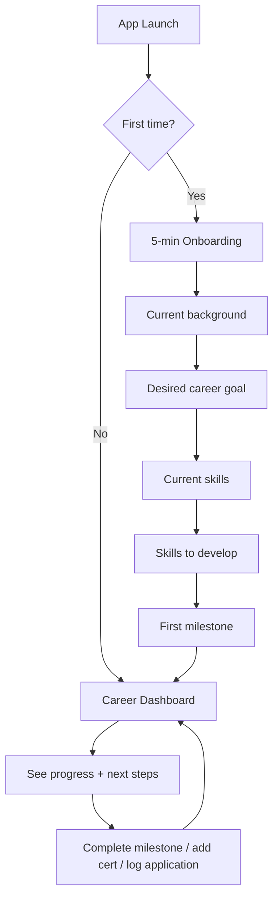
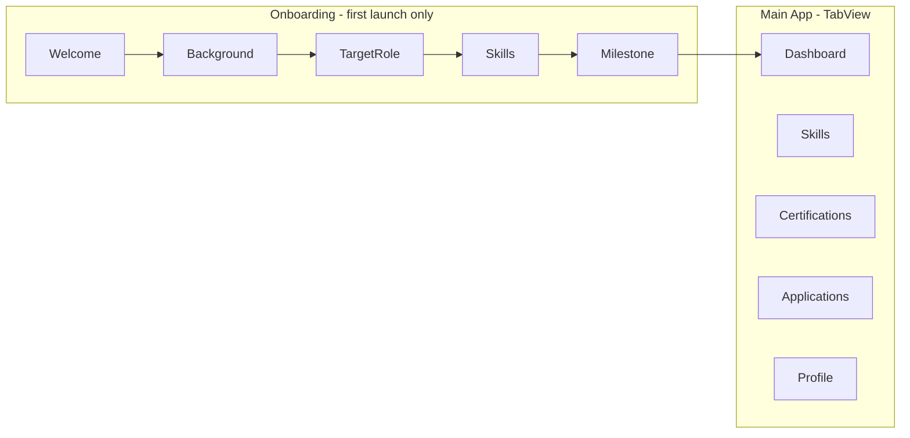

# PathPilot — Product Definition & Development Roadmap

> PathPilot is a local-first SwiftUI career transition companion for early-career switchers. MVP centers on a 5-minute onboarding that produces a personalized dashboard roadmap, with goals, skills, certifications, and job applications — built with MVVM + SwiftData over 6–8 weeks for portfolio quality.

## Competitive Landscape (Why PathPilot Exists)

| Platform | Does well | Gap PathPilot fills |
|---|---|---|
| **LinkedIn** | Networking, job listings, professional identity | No personal roadmap, no skill/cert progress, no structured transition plan |
| **Notion templates** | Flexible organization | Requires setup expertise; no mobile-native UX; no progress visualization |
| **Coursera / Udemy** | Course delivery | Tracks learning inside their platform only; no holistic career transition view |
| **Job trackers** (Huntr, Teal) | Application pipeline | Focused on jobs only; weak on skills, certs, and long-term roadmap |
| **Habit/goal apps** (Streaks, Strides) | Motivation & streaks | Generic; not career-specific; no cert or job application context |

**PathPilot's differentiation:** A focused, mobile-native "career GPS" that connects *where you are → where you're going → what to do next* — without the complexity of a job board or the blank-canvas problem of Notion.

---

## 1. One-Sentence App Description

> PathPilot is a career transition companion that helps early-career switchers build a personalized roadmap, track skills and certifications, and manage job applications — all in one structured, motivating dashboard.

---

## 2. Target User Profile

**Persona: "The Career Switcher" — Alex, 24**

- Recent psychology graduate pivoting into cloud security / tech
- Overwhelmed by conflicting advice (bootcamps, certs, portfolios, networking)
- Currently tracking progress across Notes, spreadsheets, and browser bookmarks
- Wants clarity: *"What should I do this week to get closer to my goal?"*
- Motivated but needs structure and visible progress
- Uses iPhone daily; values privacy (local data is a plus at this stage)

**Secondary users (future):** Bootcamp grads, self-taught learners, early-career professionals upskilling within their field.

---

## 3. Core Problem Statement

Career changers lack a single, structured system to connect their long-term career goal with daily actions — skills to build, certifications to earn, and jobs to apply for. Existing tools are either too broad (LinkedIn), too generic (notes/spreadsheets), or too narrow (job trackers only). PathPilot solves this by giving users a personalized roadmap and a dashboard that always answers: **"What's my next step?"**

---

## 4. Main User Journey



**First 5 minutes:**

1. Welcome screen — "Let's build your career roadmap" (30 sec)
2. Enter current background + target role (1 min)
3. Select current skills + skills to develop (1.5 min)
4. Set first milestone, e.g. "Complete AWS SAA" (1 min)
5. Land on dashboard with progress ring, next steps, and encouraging copy (1 min)

**Emotional outcome:** *"I know exactly what I need to do next."*

---

## 5. MVP Feature List (v1.0)

### In scope — essential

| Feature | Details |
|---|---|
| **Onboarding flow** | 4–5 step wizard; creates profile + initial roadmap |
| **Career dashboard** | Goal, progress %, next steps checklist, quick stats |
| **Career goal** | One primary target role (multi-goal deferred to v2) |
| **Skill tracker** | Add skills (current vs. target); mark as in-progress/complete |
| **Certification tracker** | Name, status (planned/in-progress/completed), optional target date |
| **Job application tracker** | Company, role, status (saved/applied/interview/offer/rejected), date |
| **Milestones / next steps** | Auto-generated from onboarding + user-editable checklist |
| **Local persistence** | SwiftData — data survives app restart |
| **Settings / profile edit** | Update background, goal, reset onboarding |

### Out of scope — save for v2+

- Sign in with Apple / iCloud sync
- AI career assistant or resume feedback
- Push notifications / reminders
- Multiple career goals
- Career templates marketplace
- Social sharing / export to PDF
- Widgets and Live Activities
- Deep analytics dashboard

### Too complex for beginner MVP (avoid)

- Backend API or Firebase
- Real job board integration (LinkedIn API)
- In-app course content
- Complex drag-and-drop roadmap editor
- Subscription / StoreKit paywall

---

## 6. Future Feature Ideas

- **v1.1:** Multiple career goals, milestone due dates, local notifications
- **v1.2:** Sign in with Apple + CloudKit sync
- **v2.0:** Career transition templates (e.g. "Psychology → Cybersecurity")
- **v2.1:** AI-powered next-step suggestions (OpenAI API)
- **v2.2:** Resume checklist, interview prep module
- **v3.0:** Freemium premium tier with advanced analytics and AI assistant

---

## 7. Main App Screens



| Screen | Purpose | Key components |
|---|---|---|
| **WelcomeView** | First impression | Hero copy, "Get Started" CTA |
| **OnboardingContainerView** | 5-step wizard | Progress indicator, back/next navigation |
| **DashboardView** | Home / command center | Progress ring, goal card, next steps list, quick stats |
| **SkillsListView** | Skill inventory | Segmented: Current / To Learn; add/edit/toggle complete |
| **SkillDetailView** | Single skill | Status, notes (optional) |
| **CertificationsListView** | Cert pipeline | Status badges, progress indicators |
| **CertificationFormView** | Add/edit cert | Name, status picker, target date |
| **ApplicationsListView** | Job pipeline | Kanban-style or list grouped by status |
| **ApplicationFormView** | Add/edit application | Company, role, status, date, notes |
| **ProfileView** | Settings & edit | Edit goal, background, re-run onboarding |

**Navigation pattern:** `TabView` with 5 tabs (Dashboard, Skills, Certifications, Applications, Profile). Onboarding presented as full-screen cover on first launch, controlled by `@AppStorage("hasCompletedOnboarding")`.

---

## 8. Recommended SwiftUI Architecture

**Pattern: MVVM + SwiftData + feature-based folders**

```
PathPilot/
├── App/
│   └── PathPilotApp.swift          # ModelContainer setup
├── Models/                          # SwiftData @Model classes
│   ├── UserProfile.swift
│   ├── CareerGoal.swift
│   ├── Skill.swift
│   ├── Certification.swift
│   ├── JobApplication.swift
│   └── Milestone.swift
├── ViewModels/
│   ├── OnboardingViewModel.swift
│   ├── DashboardViewModel.swift
│   ├── SkillsViewModel.swift
│   ├── CertificationsViewModel.swift
│   └── ApplicationsViewModel.swift
├── Views/
│   ├── Onboarding/
│   ├── Dashboard/
│   ├── Skills/
│   ├── Certifications/
│   ├── Applications/
│   └── Profile/
├── Components/                      # Reusable UI
│   ├── ProgressRingView.swift
│   ├── StatusBadge.swift
│   ├── CareerCard.swift
│   └── EmptyStateView.swift
├── Services/
│   ├── ProgressCalculator.swift   # Computes dashboard %
│   └── AnalyticsService.swift     # Protocol-based; local log for MVP
└── Extensions/
    └── Color+Theme.swift
```

**Key technical choices:**

| Decision | Choice | Why |
|---|---|---|
| UI framework | SwiftUI | Modern, declarative, portfolio-standard |
| Architecture | MVVM | Clear separation; interview-friendly |
| State (iOS 17+) | `@Observable` ViewModels | Less boilerplate than `ObservableObject` |
| Persistence | SwiftData | Native Swift, `@Query` integration, beginner-friendly |
| Navigation | `TabView` + `NavigationStack` | Standard iOS pattern |
| Theming | Asset catalog colors + custom `Color` extensions | Consistent "career GPS" brand |
| Onboarding gate | `@AppStorage("hasCompletedOnboarding")` | Simple, no auth needed |

**Data flow example:**

```mermaid
flowchart LR
    View[SwiftUI View] -->|user action| VM[ViewModel]
    VM -->|read/write| ModelContext[SwiftData ModelContext]
    ModelContext -->|@Query auto-refresh| View
    VM -->|computed| ProgressCalc[ProgressCalculator]
```

---

## 9. Data Models

```swift
// Conceptual schema — not production code

@Model UserProfile {
    var name: String
    var currentBackground: String      // e.g. "Psychology Graduate"
    var createdAt: Date
    var hasCompletedOnboarding: Bool
}

@Model CareerGoal {
    var targetRole: String             // e.g. "Cloud Security Analyst"
    var createdAt: Date
    var isActive: Bool
}

@Model Skill {
    var name: String
    var category: SkillCategory        // .current | .toLearn
    var status: SkillStatus            // .notStarted | .inProgress | .completed
    var createdAt: Date
}

@Model Certification {
    var name: String                   // e.g. "AWS Solutions Architect"
    var status: CertStatus             // .planned | .inProgress | .completed
    var targetDate: Date?
    var completedDate: Date?
}

@Model JobApplication {
    var company: String
    var roleTitle: String
    var status: ApplicationStatus      // .saved | .applied | .interview | .offer | .rejected
    var appliedDate: Date?
    var notes: String?
}

@Model Milestone {
    var title: String                  // e.g. "Complete AWS SAA"
    var isCompleted: Bool
    var sortOrder: Int
    var createdAt: Date
}
```

**Relationships (MVP):** Keep flat — no complex relationships. ViewModels query all models and filter. Add `@Relationship` in v2 if needed.

**Progress calculation logic** (`PathPilot/Services/ProgressCalculator.swift`):

- Skills completed / total target skills = 40% weight
- Certifications completed / total certs = 30% weight
- Milestones completed / total milestones = 20% weight
- Job applications submitted / goal (e.g. 5) = 10% weight

---

## 10. Analytics Events (Portfolio-Ready)

For MVP, implement an `AnalyticsService` protocol with a local `ConsoleAnalyticsService` (prints to Xcode console). This demonstrates product thinking and makes swapping to Firebase/telemetry trivial later.

| Event | Trigger | Why it matters |
|---|---|---|
| `onboarding_started` | Welcome screen appears | Measures top-of-funnel |
| `onboarding_completed` | Final onboarding step done | Core activation metric |
| `onboarding_step_completed` | Each step advance | Identifies drop-off points |
| `career_goal_created` | Goal saved | Confirms user defined direction |
| `skill_added` | New skill created | Feature adoption |
| `skill_completed` | Skill marked done | Engagement / progress signal |
| `certification_added` | New cert created | Feature adoption |
| `certification_completed` | Cert marked done | Milestone achievement |
| `application_added` | New job application | Job tracker adoption |
| `application_status_changed` | Status updated | Pipeline activity |
| `milestone_completed` | Checklist item done | Core progress loop |
| `dashboard_viewed` | Dashboard appears | Daily/weekly engagement proxy |
| `profile_edited` | Profile updated | Retention signal |

---

## 11. Monetization Possibilities (Post-MVP)

**Recommended path:** Free MVP → freemium v2 (no monetization code in v1).

| Tier | Features |
|---|---|
| **Free** | Goals, skills, certs, applications, dashboard (everything in MVP) |
| **Premium ($4.99/mo)** | AI career assistant, personalized roadmap suggestions, interview prep, advanced analytics |
| **Templates ($2.99 one-time)** | Pre-built career transition roadmaps (e.g. "Non-tech → Cybersecurity") |

For portfolio interviews, articulate: *"I designed the architecture to support freemium without building paywalls in v1 — user value first."*

---

## 12. Development Roadmap (6–8 Weeks)

### Phase 1: Project Setup & App Structure (Week 1)

**What:** Folder structure, theme colors, `TabView` shell, empty placeholder screens, SwiftData `ModelContainer` in `PathPilotApp.swift`.

**Why:** Foundation every feature builds on; shows architectural discipline in portfolio.

**Concepts learned:** Xcode project organization, SwiftUI app lifecycle, `TabView`, Asset Catalog, `#Preview` macros.

**Difficulty:** Easy

**Portfolio value:** Clean repo structure from day one; interviewers notice this immediately.

---

### Phase 2: User Onboarding (Week 1–2)

**What:** 5-step onboarding wizard with progress bar, `@AppStorage` gate, saves to SwiftData on completion.

**Why:** First-run experience is the product's hook — "career roadmap in 5 minutes."

**Concepts learned:** Multi-step forms, `@State` / `@Binding`, navigation between steps, `@AppStorage`, basic SwiftData inserts.

**Difficulty:** Medium

**Portfolio value:** Demonstrates UX thinking and form handling — common interview topic.

---

### Phase 3: Career Dashboard (Week 2–3)

**What:** Dashboard with progress ring, goal card, next-steps checklist, quick stat cards (skills %, certs, applications count).

**Why:** The dashboard is the daily return destination — the "career GPS" home screen.

**Concepts learned:** Computed properties, custom SwiftUI shapes (`Circle` trim for progress ring), `@Query`, reusable components.

**Difficulty:** Medium

**Portfolio value:** Visually impressive centerpiece for screenshots and demo video.

---

### Phase 4: Career Goals & Skill Tracking (Week 3–4)

**What:** Skills list (Current / To Learn segments), add/edit/delete, status toggling, skill completion updates dashboard progress.

**Why:** Skills are the core unit of progress for career switchers.

**Concepts learned:** `NavigationStack`, list CRUD, enums for status, MVVM with `@Observable`, filtering `@Query`.

**Difficulty:** Medium

**Portfolio value:** Shows full CRUD + state management — fundamental iOS skill.

---

### Phase 5: Certification Tracker (Week 4–5)

**What:** Certification list with status badges, add/edit form, optional target date, completion flow.

**Why:** Certs are major milestones for career switchers (AWS, CompTIA, etc.).

**Concepts learned:** Form validation, date pickers, status-driven UI (badge colors), SwiftData updates.

**Difficulty:** Medium (reuses patterns from Phase 4)

**Portfolio value:** Shows you can replicate patterns efficiently — good engineering habit.

---

### Phase 6: Job Application Tracker (Week 5–6)

**What:** Application list grouped by status, add/edit form, status pipeline (saved → applied → interview → offer/rejected).

**Why:** Completes the "transition triangle": learn → certify → apply.

**Concepts learned:** Grouped lists, enum-driven status pickers, optional fields, list swipe actions (delete).

**Difficulty:** Medium

**Portfolio value:** Demonstrates data modeling for real-world workflows.

---

### Phase 7: Data Persistence & Progress Logic (Week 6, parallel)

**What:** Ensure all data persists across launches; implement `ProgressCalculator`; wire dashboard to live data; profile edit screen.

**Why:** Persistence is non-negotiable for a real app; progress calculation is the product's core logic.

**Concepts learned:** SwiftData `@Model`, `@Query`, `ModelContext` save/delete, computed progress, edge cases (empty state).

**Difficulty:** Medium-Hard

**Portfolio value:** Data layer is a top iOS interview topic — this phase proves you understand it.

---

### Phase 8: UI Polish & Testing (Week 7)

**What:** Empty states, loading states, haptic feedback on milestone complete, light animations, dark mode verification, accessibility labels, manual test checklist.

**Why:** Polish separates portfolio projects from tutorials.

**Concepts learned:** `.animation()`, SF Symbols, Dynamic Type, VoiceOver labels, Xcode Previews for edge cases.

**Difficulty:** Medium

**Portfolio value:** Shows attention to detail — mention specific polish choices in interviews.

---

### Phase 9: GitHub & Portfolio Documentation (Week 8)

**What:** README with screenshots, architecture diagram, feature list, tech stack, demo GIF/video, App Store-style screenshot set, clean commit history.

**Why:** Recruiters see GitHub before they see the app — documentation is part of the portfolio.

**Concepts learned:** Technical writing, git best practices, markdown, screen recording.

**Difficulty:** Easy

**Portfolio value:** Makes the project discoverable and interview-ready. Include a "Design Decisions" section explaining why local-first, why MVVM, why SwiftData.

---

## Design System Notes

| Element | Recommendation |
|---|---|
| **Primary color** | Deep blue (#1B3A5C) — trust, professionalism |
| **Accent color** | Teal/green (#2ECC71) — progress, growth |
| **Typography** | SF Pro (system default) — Apple-native |
| **Cards** | Rounded corners (16pt), subtle shadow, white/dark adaptive background |
| **Progress** | Ring chart (Fitness-inspired) + horizontal bars for sub-progress |
| **Empty states** | Illustration + encouraging copy + CTA button |
| **Tone** | "You're making progress" not "You failed to complete" |

---

## Risk Mitigation for a Solo Beginner

| Risk | Mitigation |
|---|---|
| Scope creep | Stick to MVP list; write "future" ideas in GitHub Issues, not code |
| SwiftData learning curve | Start with one model (UserProfile) in Phase 2; add others incrementally |
| UI perfectionism | Use system components first; polish in Phase 8 only |
| Timeline slip | Phases 4–6 reuse the same CRUD pattern — each gets faster |
| Empty portfolio story | Commit after each phase; write README sections incrementally |

---

## Existing Starting Point

The repo already contains a fresh Xcode project at `PathPilot/` with default `ContentView.swift` and `PathPilotApp.swift`. Phase 1 replaces the boilerplate with the architecture described above.

---

## Development Checklist

- [ ] Phase 1: Project structure, theme, TabView shell, SwiftData ModelContainer
- [ ] Phase 2: 5-step onboarding wizard with @AppStorage gate and SwiftData save
- [ ] Phase 3: Career dashboard with progress ring, goal card, next steps
- [ ] Phase 4: Skills list CRUD with Current/To Learn segments and MVVM
- [ ] Phase 5: Certification tracker with status badges and date picker
- [ ] Phase 6: Job application tracker with status pipeline
- [ ] Phase 7: ProgressCalculator, profile edit, persistence hardening
- [ ] Phase 8: Empty states, animations, dark mode, accessibility, testing
- [ ] Phase 9: README, screenshots, demo video, GitHub portfolio docs
